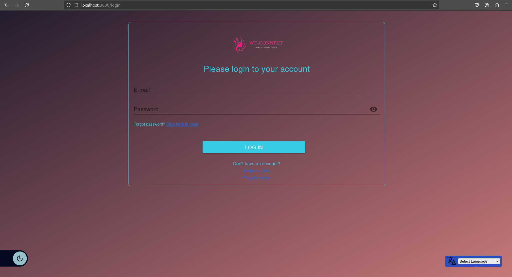
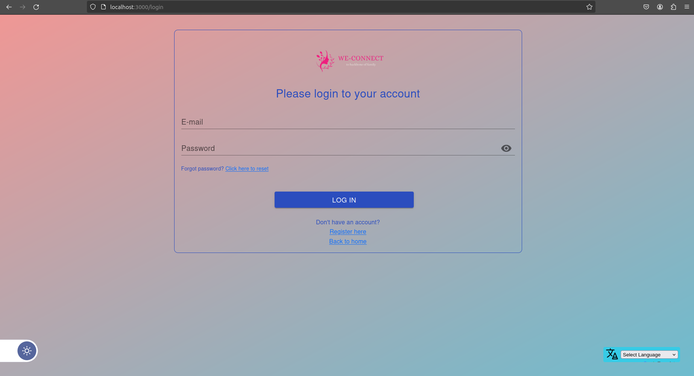
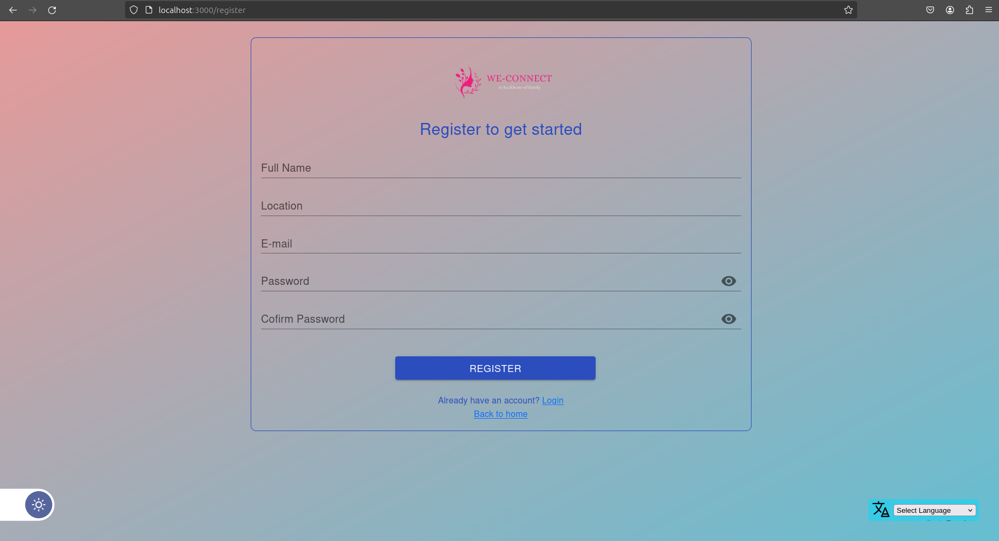
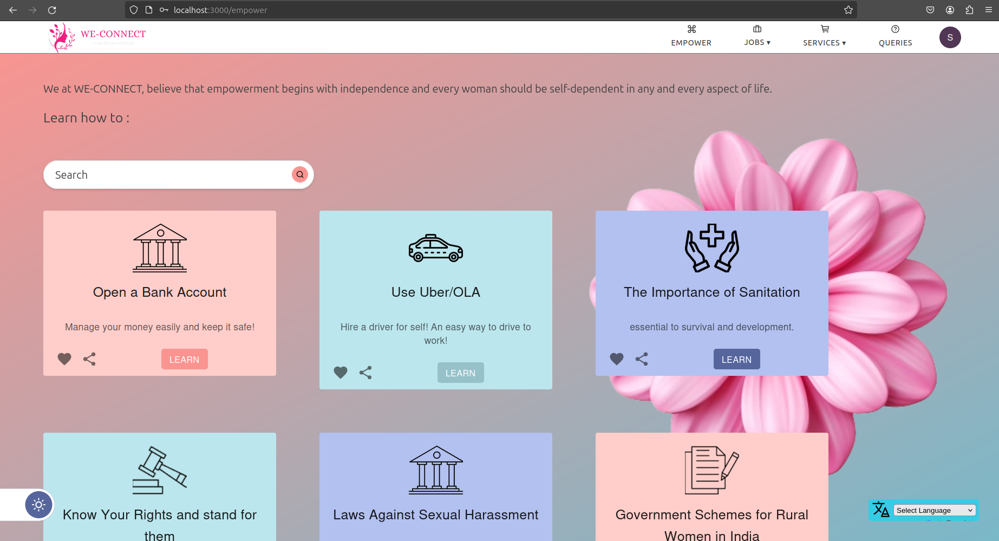
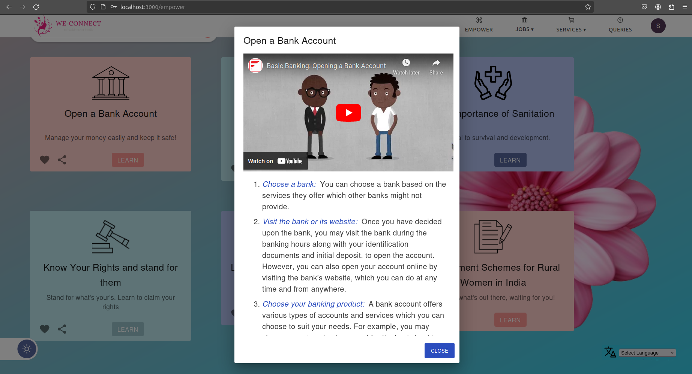
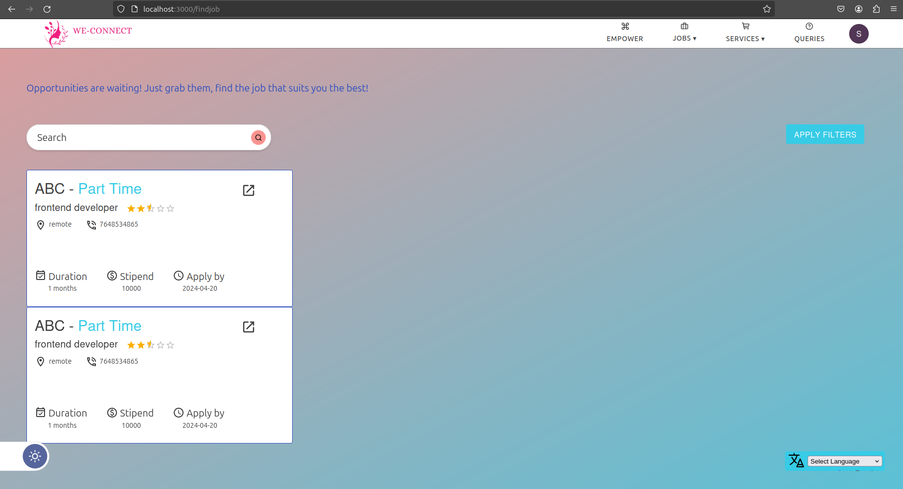
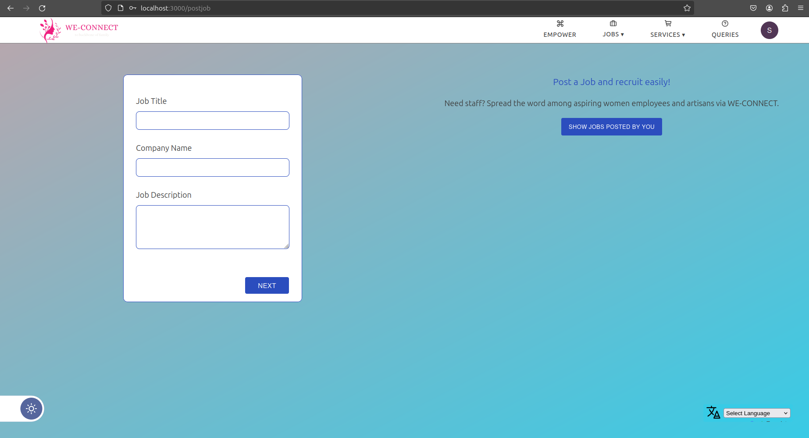
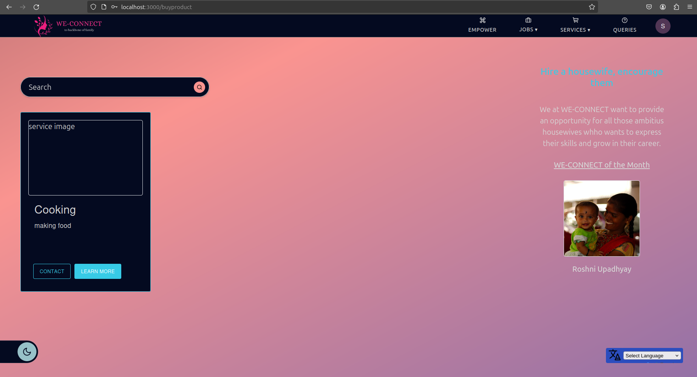
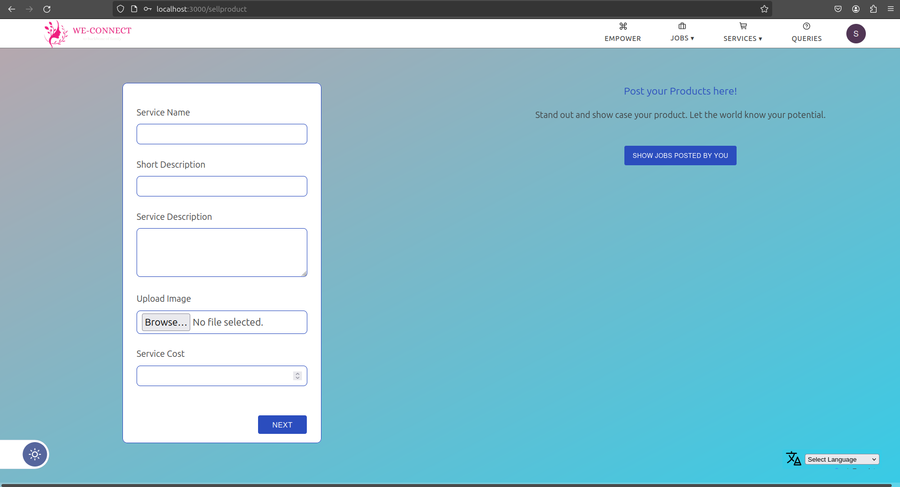
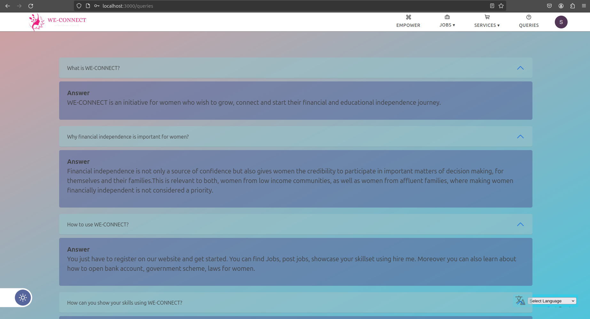

# IEEE WIEHack 5.0: 36-Hour Women-Centric Hybrid International Hackathon

## WEConnect ~ Progress begins at home

WEConnect is an innovative online platform aimed at empowering rural housewives to leverage their skills and resources, enabling them to become entrepreneurs from the comfort of their homes. Unlike traditional e-commerce platforms, WEConnect specifically caters to the needs of women from backward communities, providing them with a space to showcase their handmade products and offer services. By bridging the gap between rural and urban societies, WEConnect strives to not only foster economic independence but also promote intellectual curiosity and self-awareness among rural women.

### Key Features

1. **Empowering Women Entrepreneurs**
   - Rural women can showcase their homemade products such as pottery, embroidered materials, paintings, knitted clothing, and healthy snacks, as well as offer services on the platform.
   - Potential clients can easily browse and connect with sellers based on their nearby locations, facilitating local transactions and community engagement.

2. **Ask Desk Support**
   - Women can seek advice and solutions to their social and personal concerns through the Ask Desk section, fostering a supportive community and promoting personal development.

3. **Sentiment Analysis**
   - Utilizes sentiment analysis to maintain a positive and respectful online environment by detecting and filtering out abusive language and hate speech.

4. **Inspiring Success Stories**
   - Features a dedicated section showcasing news and articles highlighting the achievements and success stories of women across various fields, providing motivation and inspiration.

5. **SOS Feature**
   - Includes an SOS feature for emergency situations, enabling users to connect with helplines promptly in case of need.

6. **Progressive Web App (PWA)**
   - Accessible through a Progressive Web App for convenient and seamless usage on mobile devices.

### Preserving Indian Artisanal Heritage

WEConnect recognizes the rich cultural heritage of India's artisanal crafts and seeks to preserve and promote them. By providing a platform for rural artisans to showcase their skills and products, WEConnect contributes to the preservation of traditional Indian crafts and supports the economic empowerment of women.

[Experience WEConnect](https://risewithpragati.netlify.app/)

## Project Details

### Frontend

- **Tech Stack:** JavaScript
- **Framework:** REACT.Js
- **Editor:** VS Code
- Run the project by opening the `index.html` file.

### Backend

- **Tech Stack:** NodeJS, MongoDB, ExpressJS, JWT
- **Editor:** VS Code
- [Backend Repository](https://github.com/TheCodeClutch/HackNagpur-Pragati-Backend)

### Deployment

- **Database:** Atlas MongoDB
- **Hosting:** Netlify
- **Backend Server:** Heroku
- **Authentication:** Firebase

## Demo Video

## Project UI

For further inquiries or information, feel free to reach out!
